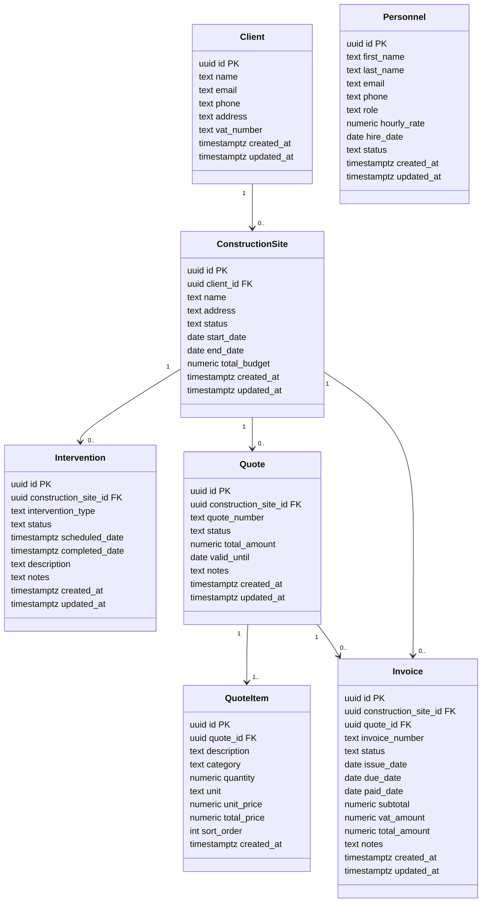

# MVP RGIE pour PWA Next.js

Ce dossier contient un kit minimal pour exploiter `rgieData.js` dans une app Next.js (App Router) avec mode PWA.

## Fichiers

- `app/api/rgie/search/route.ts`: endpoint de recherche RGIE
- `app/rgie/page.tsx`: page de recherche (liste + cartes courtes)
- `app/rgie/[id]/page.tsx`: page détail d’un article
- `next.config.js`: configuration `next-pwa`

## Intégration rapide

1. Dans ton projet Next.js, installe la dépendance:

```bash
npm i next-pwa
```

2. Copie ces fichiers en gardant la même arborescence.

3. Adapte les imports de données selon ton projet:

- Dans `route.ts` et `[id]/page.tsx`, l’import actuel pointe vers:
  - `../../../../data/rgieData.js`

4. Lance ton app:

```bash
npm run dev
```

5. Ouvre:

- `/rgie` pour la recherche
- `/rgie/[id]` pour le détail

## Notes

- Le champ `explication_profane_mobile` est utilisé pour les cartes compactes.
- Le champ `explication_profane` est utilisé pour l’explication complète.
- Pour de meilleures performances, tu peux pré-générer un JSON RGIE dédié côté Next.


